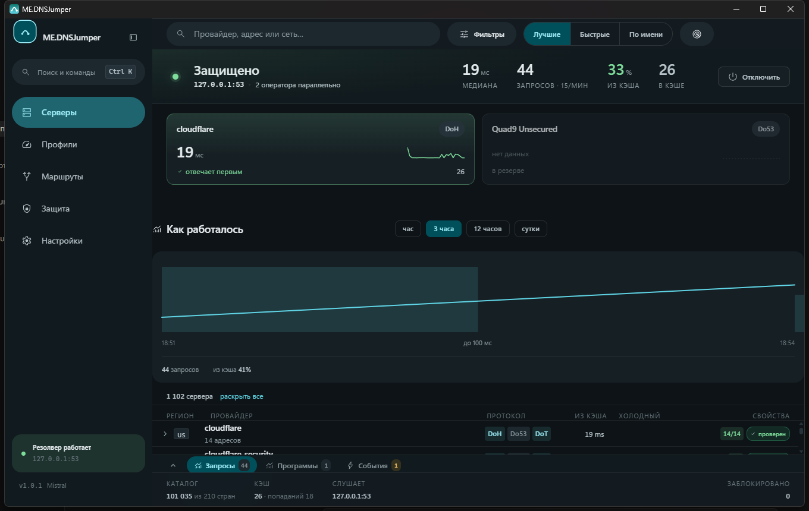
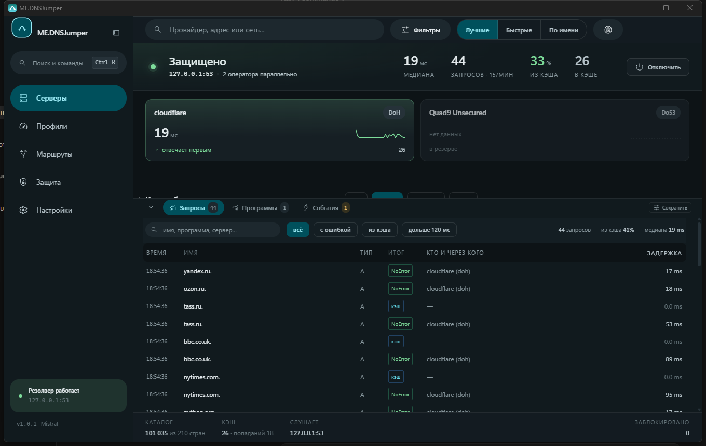
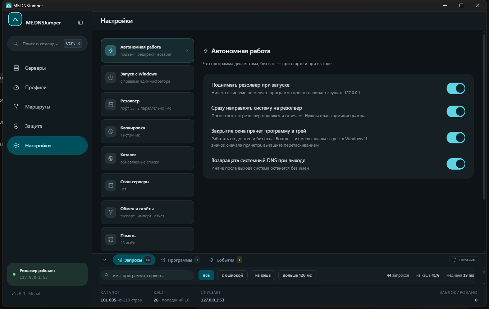

# ME.DNSJumper

**Ваш DNS — это список всех сайтов, куда вы ходите.**
По умолчанию он уходит провайдеру открытым текстом. Эта программа делает так, чтобы не уходил.

### [⬇ Скачать](https://github.com/mintyextremum/ME.DNSJumper/releases/latest) · [📖 Документация](https://mintyextremum.github.io/ME.DNSJumper/) · [🛠 DoH заблокировали](https://mintyextremum.github.io/ME.DNSJumper/blocking/)

 

 

## Если коротко

Программа поднимает у вас на машине маленький DNS-резолвер и направляет систему на него.
Дальше каждый запрос уходит **зашифрованным сразу к нескольким независимым серверам**, и
побеждает тот, кто ответил первым и по-настоящему. Один сервер соврал или замолчал — этого
никто не заметил.

Серверов в каталоге сто тысяч, и ни одному из них не верят на слово: программа сама меряет
задержку, проверяет подписи и ловит подмену несуществующих имён. То, что вы видите на
экране, измерено на вашей машине с вашего канала — не взято из чужого списка.

**Ни телеметрии, ни аккаунта, ни наших серверов.** Всё живёт у вас.

 

## Зачем это сейчас

Провайдеры взялись за **шифрованный DNS** — DoH у Google и Cloudflare. Логика простая: пока
DNS зашифрован, не видно, куда вы ходите, и блокировать прицельно нечего. Сломать
шифрованный DNS — значит вернуть машину на открытый DNS провайдера.

Программа сделана против ровно этого сценария:

- **не держится за одного оператора** — в каталоге сотни адресов, а не два;
- **не держится за один транспорт** — закрыли DoH, остаются DoT, DoQ и DNSCrypt;
- **пробивает фильтр по имени** — режет рукопожатие так, что имя сервера не попадает целиком
  ни в один кусок;
- **не гадает, а меряет** — проверяет каждый транспорт по-настоящему с вашего канала.

Что делать, когда уже заблокировали, — [пошагово здесь](https://mintyextremum.github.io/ME.DNSJumper/blocking/).

 

## Как это выглядит

<table>
<tr>
<td width="50%">

**Журнал: видно каждый запрос**

Кто спросил, у кого получилось, за сколько и пришёл ли ответ из кэша. Строку можно разобрать
на «Защите» одним нажатием.

</td>
<td width="50%">

</td>
</tr>
<tr>
<td width="50%">

</td>
<td width="50%">

**Защита: видно, кто идёт мимо**

Какие программы и адаптеры спрашивают не вас. Рядом — «кто что отвечает»: одно имя
спрашивается у всех серверов и у провайдера сразу, и подмена видна, а не предполагается.

</td>
</tr>
<tr>
<td width="50%">

**Настройки: без тайн**

Каждый переключатель говорит, что случится, а не как он устроен. Отдельно видно, что
программа помнит, и это можно стереть одной кнопкой.

</td>
<td width="50%">

</td>
</tr>
</table>

 

## Что она умеет

| | |
|---|---|
| **Шесть транспортов** | DoH, DoH/3, DoT, DoQ, DNSCrypt v2 и ODoH через ретранслятор |
| **Обход фильтра по имени** | Режет рукопожатие внутри имени; стратегия подбирается и запоминается по каждому серверу |
| **Проверка линии** | Что доходит именно с вашего канала — измерением, а не предположением |
| **Разбор сайта** | Подмена DNS, фильтр по имени или выброшенный адрес — и что из этого чем лечится |
| **Подписи DNSSEC** | Проверяет сама, от вшитого корневого ключа вниз по зонам |
| **Один запрос вместо трёх** | Спрашивает лучшего; остальных подключает, только если он молчит |
| **Свои списки блокировки** | Работают до гонки, поэтому не зависят от того, какой сервер ответил |
| **Перехват всех имён** | Через политику DNS-клиента, не трогая адаптеры и не ломая VPN |
| **Соседство с zapret** | Видит его, не мешает и умеет передать домен в его хостлист |
| **Кэш, переживающий блокировку** | Недавние сайты открываются, даже когда серверы легли |
| **Профили** | Свой набор серверов по сети, времени суток, программе или адаптеру |

 

## Установка

Скачайте установщик со [страницы релизов](https://github.com/mintyextremum/ME.DNSJumper/releases/latest)
и запустите. Дальше программа обновляется сама, а пакет проверяет по подписи — подменённый
файл не установится.

Чтобы она работала совсем без вас: **Настройки → Запуск с Windows → С правами
администратора**, затем **Автономная работа → Сразу направлять систему на резолвер**.

**Метки в заголовке релиза.** Первая говорит, чем выпуск является: `Major Update`, `Update`,
`Fix` или `HotFix` — тот же Fix, выпущенный вне очереди. Вторая — можно ли на него
обновиться: `Stable Release`, либо `Legacy — Outdated` у сборок старше 0.5.0, где
обновлятора ещё не было.

 

## Чего она не делает

Честнее сказать сразу, чем оставить это выясняться.

- **Не трогает чужие пакеты.** Режет она только свои DNS-соединения. Десинк произвольного
  трафика требует драйвера и делается через [zapret](https://github.com/bol-van/zapret), с
  которым она спокойно уживается.
- **Не обходит блокировку по адресу.** Если сайт отказывает, посмотрев, откуда вы, — DNS тут
  бессилен.
- **Не включает ECH в браузере.** Для этого браузеру нужен свой защищённый DNS.

Подробно и без прикрас — [«Границы»](https://mintyextremum.github.io/ME.DNSJumper/limits/).

 

**MIT** · [Документация](https://mintyextremum.github.io/ME.DNSJumper/) ·
[Уязвимости](SECURITY.md)

